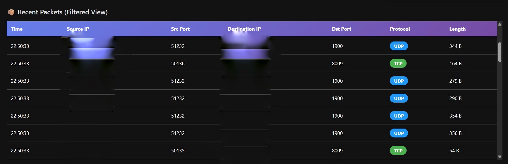

# 🔒 Advanced Network Monitor

A real-time network monitoring and security analysis tool with WebSocket-based dashboard for packet inspection, DNS query tracking, and intrusion detection.


## ✨ Features

### 📡 Network Monitoring
- **Real-time Packet Capture**: Monitor TCP, UDP, ICMP, and DNS traffic
- **Protocol Statistics**: Live breakdown of network protocol distribution
- **Traffic Analysis**: Historical packets-per-second visualization
- **Top Talkers**: Identify most active IPs and ports

### 🔐 Security Features
- **Port Scan Detection**: Automatic detection of port scanning attempts (10+ ports in 10 seconds)
- **Suspicious Port Monitoring**: Alert on connections to high-risk ports (FTP, SSH, Telnet, RDP, SMB)
- **Real-time Threat Alerts**: Immediate notification system for security events
- **IP-based Threat Tracking**: Monitor suspicious IP addresses

### 📊 Dashboard
- **Live Packet Feed**: Real-time packet table with source/destination details
- **DNS Query Monitor**: Track all DNS requests with timestamps
- **Interactive Filtering**: Filter packets by protocol, IP address, or port
- **WebSocket Updates**: Ultra-low latency live data streaming

### 💾 Data Persistence
- **SQLite Database**: Store packet history, DNS queries, and security alerts
- **Historical Analysis**: Query past network activity
- **Alert Logging**: Permanent record of security events

## 🖥️ Screenshots

### Main Dashboard


### Security Alerts


## 🛠️ Requirements

- **Python 3.8+**
- **Administrator/Root privileges** (required for packet capture)
- **Npcap** (Windows) or **libpcap** (Linux/macOS)

## 📦 Installation

### Windows

1. **Install Npcap**
   - Download from [npcap.com](https://npcap.com/#download)
   - Install with "WinPcap API-compatible Mode" enabled

2. **Clone the repository**
   ```bash
   git clone https://github.com/Rakanun/advanced-network-monitor.git
   cd advanced-network-monitor
   ```

3. **Install dependencies**
   ```bash
   pip install -r requirements.txt
   ```

### Linux

```bash
# Install libpcap
sudo apt-get update
sudo apt-get install libpcap-dev python3-pip

# Clone repository
git clone https://github.com/Rakanun/advanced-network-monitor.git
cd advanced-network-monitor

# Install dependencies
pip3 install -r requirements.txt
```

### macOS

```bash
# Install dependencies via Homebrew
brew install libpcap

# Clone repository
git clone https://github.com/Rakanun/advanced-network-monitor.git
cd advanced-network-monitor

# Install Python dependencies
pip3 install -r requirements.txt
```

## 🚀 Usage

**Important**: Must be run with Administrator/Root privileges

### Quick Start

```bash
# Windows (PowerShell as Administrator)
python setup_and_run.py

# Linux/macOS
sudo python3 setup_and_run.py
```

### Manual Start

```bash
# Windows
python main.py

# Linux/macOS
sudo python3 main.py
```

Access the dashboard at: **http://localhost:8000**

## 📊 Dashboard Guide

### Main Interface

1. **Statistics Panel** (Top)
   - Total packets captured
   - Current packets per second
   - Uptime counter
   - Protocol distribution pie chart

2. **Live Packet Table** (Center)
   - Timestamp, Source IP, Destination IP
   - Source/Destination ports
   - Protocol type
   - Packet length

3. **Filters** (Right Sidebar)
   - Filter by Protocol (TCP/UDP/ICMP/DNS)
   - Filter by IP Address
   - Filter by Port Number

4. **Security Alerts** (Bottom)
   - Real-time security event notifications
   - Alert severity levels
   - Suspicious activity descriptions

5. **Additional Panels**
   - DNS Queries Monitor
   - Top 5 Active Ports
   - Top 5 Active IPs
   - Traffic History Graph

## ⚙️ Configuration

### Network Interface Selection

Edit `main.py` to specify your network interface:

```python
CAPTURE_INTERFACE = "eth0"  # Linux
CAPTURE_INTERFACE = "en0"   # macOS
CAPTURE_INTERFACE = None    # Auto-detect (default)
```

### Security Thresholds

```python
PORT_SCAN_THRESHOLD = 10  # Number of ports to trigger alert
SUSPICIOUS_PORTS = [21, 22, 23, 3389, 445, 135, 139]
```

### Database Configuration

```python
DB_FILE = "network_logs.db"  # SQLite database path
```

## 🗄️ Database Schema

### Tables

**packets**
- `id`: Primary key
- `timestamp`: Packet capture time
- `src_ip`: Source IP address
- `dst_ip`: Destination IP address
- `protocol`: Protocol type (TCP/UDP/ICMP)
- `src_port`: Source port
- `dst_port`: Destination port
- `length`: Packet size in bytes

**dns_queries**
- `id`: Primary key
- `timestamp`: Query time
- `query`: DNS query domain
- `response`: DNS response (if captured)

**alerts**
- `id`: Primary key
- `timestamp`: Alert time
- `alert_type`: Type (Port Scan/Suspicious Port)
- `description`: Alert details
- `src_ip`: Source IP triggering alert

## 🔐 Security Features Explained

### Port Scan Detection
Detects when a single IP address attempts to connect to 10 or more different ports within 10 seconds - a common port scanning signature.

### Suspicious Port Monitoring
Monitors connections to commonly exploited ports:
- **21** (FTP)
- **22** (SSH)
- **23** (Telnet)
- **135, 139, 445** (Windows SMB)
- **3389** (RDP)

## 🤝 Contributing

Contributions are welcome! Please follow these steps:

1. Fork the repository
2. Create a feature branch
   ```bash
   git checkout -b feature/AmazingFeature
   ```
3. Commit your changes
   ```bash
   git commit -m 'Add: AmazingFeature description'
   ```
4. Push to your branch
   ```bash
   git push origin feature/AmazingFeature
   ```
5. Open a Pull Request

### Development Guidelines
- Follow PEP 8 style guide
- Add comments for complex logic
- Update documentation for new features
- Test thoroughly before submitting PR

## 📝 License

This project is licensed under the MIT License - see the [LICENSE](LICENSE) file for details.

## ⚠️ Legal Disclaimer

**IMPORTANT**: This tool is intended for:
- Educational purposes
- Authorized network monitoring
- Personal network security analysis

**Unauthorized network monitoring or packet capturing may be illegal in your jurisdiction.** Always ensure you have proper authorization before monitoring any network traffic.

## 🐛 Troubleshooting

### "Permission Denied" Error
- **Solution**: Run with Administrator/Root privileges

### "No module named 'scapy'" Error
- **Solution**: Install requirements: `pip install -r requirements.txt`

### "Interface not found" Error
- **Solution**: Set `CAPTURE_INTERFACE = None` for auto-detection or specify correct interface name

### Windows: "Npcap not found"
- **Solution**: Install Npcap from [npcap.com](https://npcap.com/#download)

## 🔮 Roadmap

- [ ] Add packet payload inspection
- [ ] Implement GeoIP location tracking
- [ ] Add export functionality (CSV/JSON)
- [ ] Create mobile-responsive dashboard
- [ ] Add user authentication
- [ ] Implement traffic replay functionality
- [ ] Add machine learning anomaly detection

## 👤 Author

**Rakanun**
- GitHub: [@Rakanun](https://github.com/Rakanun)
- Bio: CS Student | Networking | Cybersecurity | AI
- Focus: SOC Analysis & Network Engineering

## 🙏 Acknowledgments

- [FastAPI](https://fastapi.tiangolo.com/) - Modern web framework
- [Scapy](https://scapy.net/) - Powerful packet manipulation library
- [Uvicorn](https://www.uvicorn.org/) - Lightning-fast ASGI server
- Community contributors and testers

## 📧 Support

If you encounter any issues or have questions:
1. Check the [Issues](https://github.com/Rakanun/advanced-network-monitor/issues) page
2. Create a new issue with detailed description
3. Include error messages and system information

---

⭐ **Star this repository if you find it useful!**
